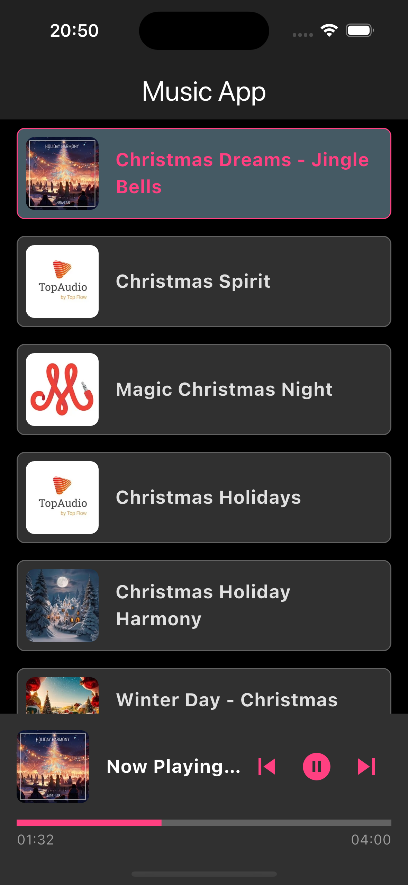

# Music Test: Flutter Application Setup Guide

This README provides detailed instructions for setting up and running the Flutter application. Follow the steps below to get started.

---

## Prerequisites

Before running the project, ensure that the following prerequisites are installed:

1. **Flutter SDK**  
   Download and install Flutter SDK from the [official website](https://flutter.dev/docs/get-started/install).

2. **Dart SDK**  
   Dart SDK comes pre-installed with the Flutter SDK.

3. **Android Studio**  
   Install [Android Studio](https://developer.android.com/studio) for running Android emulators or connecting Android devices.

4. **Xcode (macOS only)**  
   Install Xcode from the Mac App Store to run the application on iOS devices.

5. **Code Editor**  
   Use a code editor such as [Visual Studio Code](https://code.visualstudio.com/) or Android Studio.

6. **Git**  
   Install Git to clone the repository: [Git Installation Guide](https://git-scm.com/).

---

## Setup Instructions

### 1. Clone the Repository
Clone the project repository to your local machine:
```bash
git clone https://github.com/oil-yukonthorn/music_test.git
cd  ../music_test
```

### 2. Install Flutter Dependencies
Navigate to the project directory and run the following command to install the required dependencies:
```bash
flutter pub get
```

---

## Running the Application

### 1. For Android
- **Set Up Android Emulator**  
  Open Android Studio > Tools > AVD Manager > Create Virtual Device > Select a device and system image > Finish.

- **Connect Android Device**  
  Connect a physical Android device to your machine and enable USB debugging.

- **Run the Application**  
  Use the following command to run the app:
  ```bash
  flutter run
  ```

### 2. For iOS (macOS only)
- **Set Up iOS Simulator**  
  Open Xcode > Preferences > Components > Download a simulator.

- **Connect iOS Device**  
  Plug in a physical iOS device and ensure it is detected by your machine.

- **Run the Application**  
  Run the following command:
  ```bash
  flutter run
  ```

  If there are issues with CocoaPods, navigate to the `ios` directory and run:
  ```bash
  pod install
  cd ..
  ```

---

## Common Commands

- **Check Flutter Environment**  
  Check if Flutter is set up correctly:
  ```bash
  flutter doctor
  ```

- **Clean Build Cache**  
  If you encounter build issues:
  ```bash
  flutter clean
  flutter pub get
  ```

- **Run in Debug Mode**  
  For live debugging:
  ```bash
  flutter run --debug
  ```

- **Run in Release Mode**  
  For optimized performance:
  ```bash
  flutter run --release
  ```

---

## Directory Structure
```plaintext
lib/
├── features/
│   ├── music/
│   │   ├── controller/
│   │   │   └── music_controller.dart        # Business logic for musics
│   │   ├── models/
│   │   │   └── music_model.dart             # Model music data
│   │   ├── screen/
│   │   │   └── musics_screen.dart             # Entry point for the musics screen
│   │   ├── services/
│   │   │   └── music_service.dart           # Manages services
├── main.dart                    # Main entry point of the app
```
---
